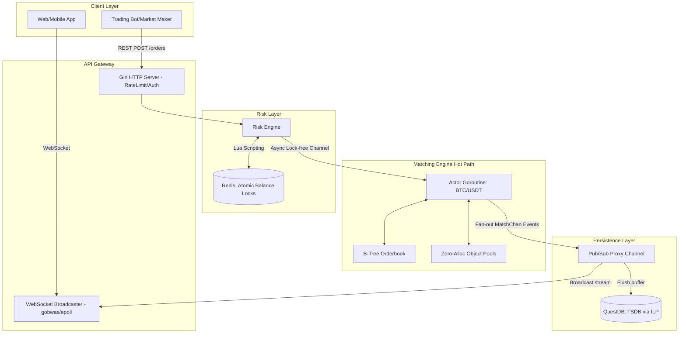

# High-Performance Limit Order Book (LOB) Exchange Engine

A production-grade, ultra-low latency cryptocurrency / stock exchange matching engine and orderbook infrastructure developed in Go. The system is designed following the **Actor Model** and is specifically engineered to handle thousands of requests per second with extremely deterministic performance.

Looking for a deep dive into how it works? Read [**The Journey of an Order (ENGINE_EXPLAINED.md)**](./ENGINE_EXPLAINED.md).

## 🚀 Key Features and Optimizations

This engine has been meticulously crafted targeting a Principal Engineer/HFT (High-Frequency Trading) baseline.

- **Zero-Allocation Core Engine**: The matching engine achieves almost `0 allocs/op` on the hot path by utilizing preemptive Object Pools (`sync.Pool` / Custom FreeLists) for order nodes (`LimitPool`, `MatchPool`). This guarantees that Go's Garbage Collector does not halt the world during market volatility.
- **Lock-free Actor Concurrency**: Employs a single Event-Loop Goroutine per trading pair (e.g., `BTC/USDT`). Order submissions and cancellations are passed via deep channels mimicking ring-buffers, entirely dodging `sync.Mutex` lock-contention penalties common in multi-threaded orderbooks.
- **Cache-Locality Data Structures**: 
  - Uses `tidwall/btree` (Google B-Tree logic) for constant $O(\log n)$ price level discovery instead of standard Red-Black heaps.
  - Price levels consist of an *Intrusive Doubly Linked List* (FIFO Queue), allowing $O(1)$ constant time order cancellations without searching.
- **Risk Engine on Redis Lua**: Pre-trade balance locking uses atomic Lua scripting embedded deeply inside a Redis engine via connection pools to safeguard against partial fills and double-spending race conditions.
- **Native Epoll WebSockets (`gobwas/ws` & `netpoll`)**: Replaces standard `gorilla/websocket` with direct OS-level event polling (Epoll on Linux, Kqueue on Mac) to seamlessly broadcast Orderbook and Trade events to hundreds of thousands of concurrent clients without spinning up equal amounts of Goroutines (CPU/RAM exhaustion).
- **Time-Series Persistence (`QuestDB`)**: Asynchronously streams raw matched trade events out of the hot path into QuestDB using the native and hyper-fast InfluxDB Line Protocol (ILP) TCP/HTTP sender.

## 🏗 System Architecture



## 🛠 Prerequisites

To run the simulation, you will need the underlying databases mapping the state and time-series layers:
1. **[Redis](https://redis.io/docs/install/install-redis/)** (Listens on `localhost:6379`)
2. **[QuestDB](https://questdb.io/docs/get-started/docker/)** (Listens on `localhost:9009` for ILP)

You can spin them up quickly via Docker:
```bash
docker run -d -p 6379:6379 --name redis redis:alpine
docker run -d -p 9000:9000 -p 9009:9009 -p 8812:8812 -p 9004:9004 --name questdb questdb/questdb:latest
```

## 💻 Running the Server
```bash
# Clone the setup and tidy modules
go mod tidy

# Run the test benchmarking suite to view the performance metrics (Nanoseconds latency mapping)
go test -v ./engine/... -bench . -benchmem

# Build the system
go build -o exchange_server main.go

# Start the environment
./exchange_server
```

## 🔌 API Endpoints Reference

Currently, the server runs on `:8080`. API keys are enforced (Header: `X-API-KEY: ultra-secret-key`).

### 1. Mock Deposit Funds
Provides a mock balance bypassing blockchain integrations for testing.
```bash
curl -X POST "http://localhost:8080/deposit?user_id=1&asset=USDT&amount=1000000" -H "X-API-KEY: ultra-secret-key"
```

### 2. Place an Order
```bash
curl -X POST http://localhost:8080/orders \
-H "X-API-KEY: ultra-secret-key" \
-H "Content-Type: application/json" \
-d '{
    "user_id": 1,
    "price": 50000,
    "qty": 2,
    "side": "buy"
}'
```

### 3. Subscribe to Real-time Market Data (WebSockets)
```text
ws://localhost:8080/ws/market
```
Sends live JSON payloads whenever matches are formed in the engine.

## 📊 Benchmarks overview (M4 Pro CPU)

```
BenchmarkEngineAsyncPlacing-12    	 1535514	       806.2 ns/op	    2277 B/op	       8 allocs/op
BenchmarkOrderbookMatch-12        	 3161322	       372.1 ns/op	    2280 B/op	       9 allocs/op
BenchmarkQuestDBWorkerQueue-12    	28093230	        38.98 ns/op
```
Calculates to millions of operations parsed under extreme concurrency cleanly.

## 🔮 Roadmap / Next Steps
- Implement REST cancellation `/orders/:id` wrapper mapped to the Engine's `CancelOrder`.
- Expose the B-Tree `Depth()` structure via WebSocket to visualize Level 2 (L2) depth charts.
- Scale from Single Node Matching into Kube-native multi-pod pairings utilizing consistent hashing (Raft).
